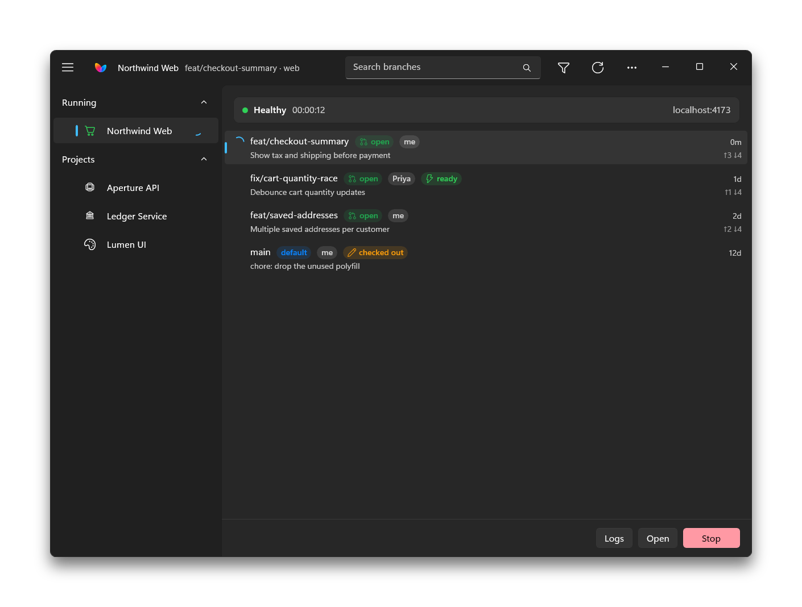
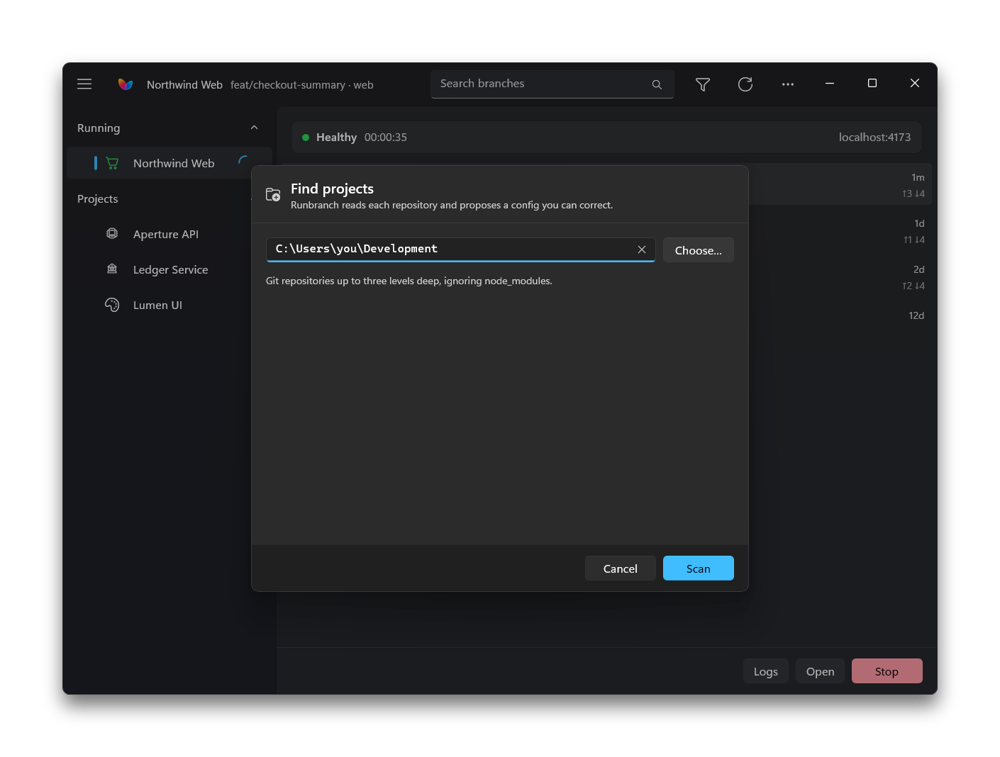
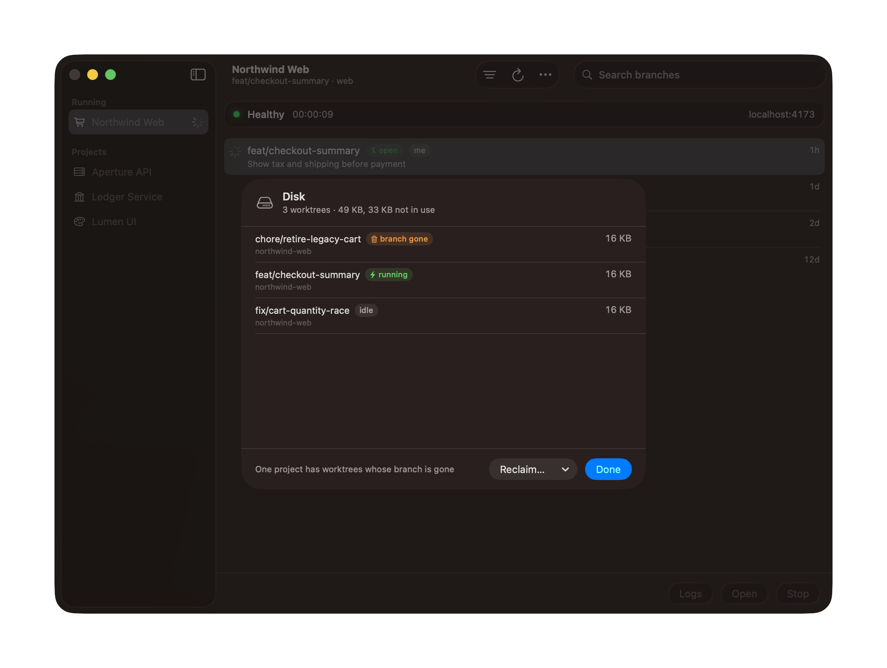
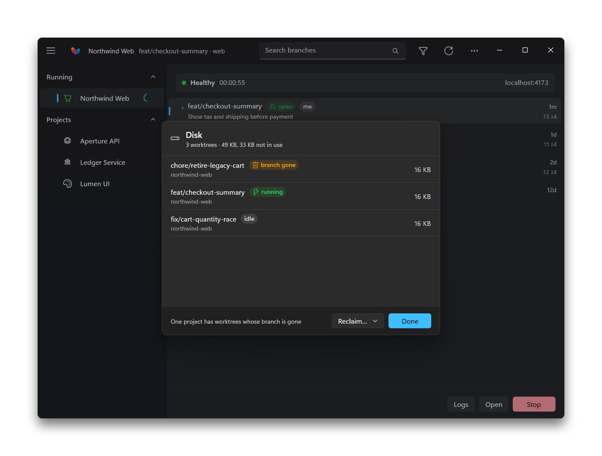
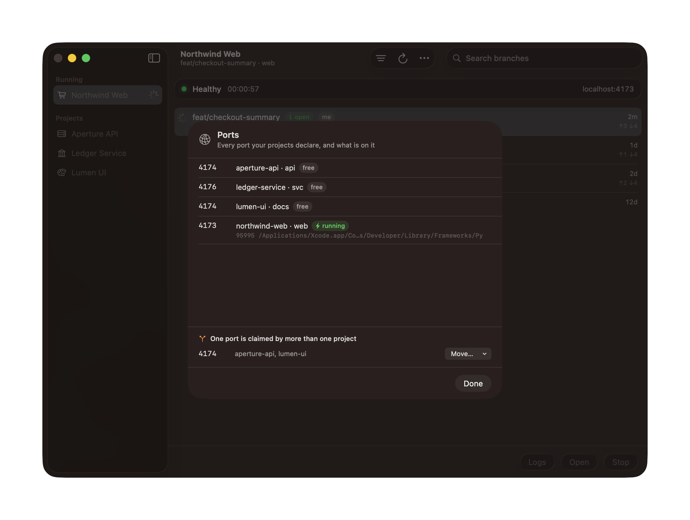
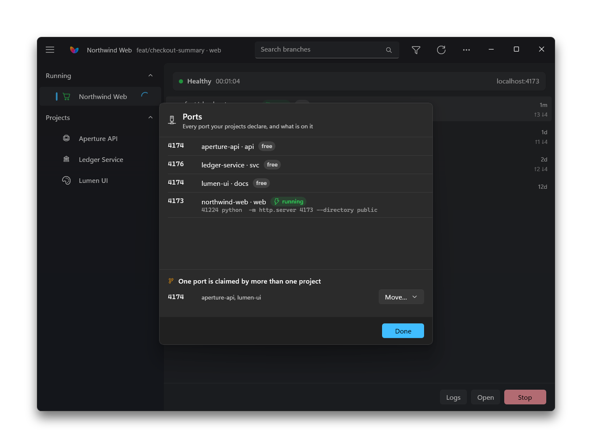
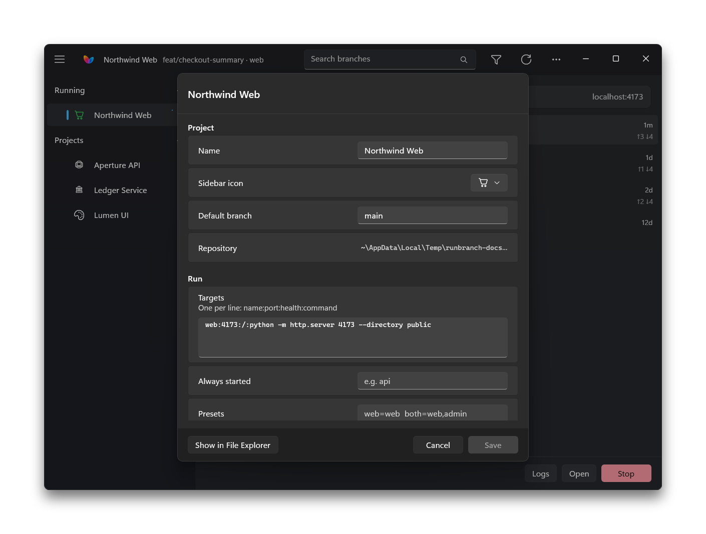

<div align="center">


# Runbranch

**Run any branch of any project, on a real port.**

Isolated by default — a throwaway git worktree, so your checkout is never
touched. Or in place, in the checkout itself, when what you want to see is what
you are typing.

A native app on **macOS** and on **Windows 11**, over one shared engine.

[](LICENSE)
[](#macos)
[](#windows)
[](docs/TESTING.md)

<table>
<tr>
<td align="center"><b>macOS</b></td>
<td align="center"><b>Windows 11</b></td>
</tr>
<tr>
<td></td>
<td></td>
</tr>
</table>

</div>

---

## Why

A colleague's pull request needs a look. Not a diff — a look. You want to click
the thing. Your options today are all bad:

- **Switch branches in your checkout.** Fails on uncommitted work, or silently
  changes what you were doing.
- **Clone the repo again.** The gitignored `.env` doesn't come with it, so
  everything 401s and it looks like the branch is broken.
- **Keep a second checkout by hand.** You'll forget to update it, and you won't
  remember to delete its `node_modules`.
- **Wait for a preview deploy.** If the stack even has one, and if it can reach
  the data you need.

Runbranch does the version you'd build yourself given an afternoon: a throwaway
git worktree per branch, your gitignored config copied in, dependencies
installed, servers started, and a window that tells you when it's actually up.

> [!IMPORTANT]
> **Your checkout is never modified.** No `git checkout`, no `git stash`, ever.
> A worktree run happens in its own directory; an in-place run starts your
> servers where they already are and writes nothing.

---

## Install

The same app on both, built natively for each: SwiftUI on the Mac, WinUI 3 on
Windows, and one engine underneath that does the actual work. Configs are the
same files on both, so a `.conf` committed to a repo works for everyone on it.

### macOS

Download the disk image from the [latest
release](https://github.com/aosmcleod/runbranch/releases/latest) and drag
Runbranch to Applications.

Or build it, which takes a few seconds and needs the Xcode command line tools
(`xcode-select --install`) and [Go](https://go.dev/dl/) for the engine:

```bash
git clone https://github.com/aosmcleod/runbranch
cd runbranch && ./make-app.sh --release && open .
```

`--release` because a plain `./make-app.sh` gives you a *development* build:
the same app with its mark inverted and a badge in About, so a copy being
worked on is not mistakable for the one you installed. It also does not update
itself. That is what you want when you are changing the code and not what you
want when you are installing it.

> [!IMPORTANT]
> Either way, the first launch is refused — macOS says it cannot check the app
> for malicious software. The build is signed with a self-signed certificate
> rather than a paid Apple Developer ID, which is a statement about the
> certificate and not about the app. Open **System Settings → Privacy &
> Security**, scroll to Security, and press **Open Anyway** on the line about
> Runbranch. Once, then it opens normally — and only once ever: Runbranch
> updates itself from here, and an update it installs does not ask again.
> Removing the step for the *first* launch needs notarisation, which needs a
> paid Apple Developer account; it is on the [roadmap](docs/ROADMAP.md) and not
> done.

By default `make-app.sh` signs ad-hoc, which means a new identity on every
build — and macOS ties privacy permissions to the signature, so anything you
grant the app is dropped the next time you rebuild. If that gets tiresome:

```bash
./tools/make-signing-identity.sh    # a self-signed identity, once
```

Builds then keep one stable identity, and a permission you grant survives a
rebuild. It does not make the app notarised and does not remove the
right-click on first launch.

### Windows

Download `Runbranch-<version>-windows-x64.zip` from the [latest
release](https://github.com/aosmcleod/runbranch/releases/latest), extract it
anywhere you like — `%LOCALAPPDATA%\Programs\Runbranch` is a good home — and
run `Runbranch.exe`. No installer, no administrator prompt, nothing written
outside your user folder. Pin it to Start or the taskbar from there.

> [!IMPORTANT]
> The first launch may be stopped by SmartScreen with *Windows protected your
> PC*, because the download is not code-signed. Press **More info**, then
> **Run anyway**. Once: Runbranch updates itself from then on, and an update
> it downloads itself does not ask again.

Long paths — deep `node_modules` trees in a worktree — work without changing
any Windows setting. Runbranch passes git what it needs on every call and
deletes through long-path names itself.

To build it, you need [Go](https://go.dev/dl/) and the [.NET 10
SDK](https://dotnet.microsoft.com/download):

```powershell
git clone https://github.com/aosmcleod/runbranch
cd runbranch; .\windows\make-app.ps1 -Release
.\dist\windows\Runbranch\Runbranch.exe
```

As on the Mac, leaving out `-Release` gives you a development build, with the
inverted mark and no self-update.

---

## Point it at a repo

<table><tr>
<td></td>
<td></td>
</tr></table>

You shouldn't have to write a config from nothing. **Add project…** in the
`•••` menu reads the repo — package manager, lockfile, scripts, `Procfile`,
compose services, version pins, which files are gitignored — and proposes one,
then opens it so you can correct the guesses.

A complete project can be four lines:

```bash
NAME="my-app"
REPO="~/code/my-app"
INSTALL="pnpm install --frozen-lockfile"
TARGETS="web:3000:/:pnpm dev"
```

<details>
<summary><b>Bigger stacks add only what they need</b></summary>

```bash
COPY_FILES=".env.local"                    # gitignored, so a worktree lacks it
COMPOSE_SERVICES="postgres valkey"         # brought up and health-waited
MIGRATE="pnpm --filter @app/db db:migrate"
SEED="pnpm --filter @app/db db:seed"       # an empty app isn't worth looking at
RUNTIME="mise"                             # honour the repo's pinned versions
DB_URL_VARS="DATABASE_URL"                 # a database per branch
TARGETS="api:4000:/health:pnpm --filter api dev
web:3000:/:pnpm --filter web dev"
ALWAYS="api"                               # web is useless without it
PRESETS="web=web  full=web,worker"
```

A `Procfile` needs no target list at all — set `PROCFILE=1` and its processes
become your targets.

</details>

Full reference: **[docs/config.md](docs/config.md)**. Check any project with
`runbranch doctor`, which names the command that fixes whatever it finds.

---

## What you get

**A window that tells the truth.** Branches for the selected project, newest
first, each with its pull request state, who wrote it, and what it's actually
about — the PR title, not just the branch name. Each says how far it has drifted
from the default branch, in commits ahead and behind, so a branch you don't
recognise says whether it is live work or a leftover. Remote branches with an
open pull request are listed too, because reviewing someone else's work is the
whole point. Merged and stale branches stay out of the way until you ask —
merged by the pull request record or by the commit graph, which is the only
thing that sees a branch someone landed by hand.

**A run you can watch.** Press Start and the work happens in front of you:
worktree, install, infrastructure, migrations, seed, servers. It closes itself
when the thing is up and stays put when it isn't — which is the only moment the
log matters.

**Two kinds of run, and the difference matters.**

|  | Worktree run *(default)* | In-place run |
|---|---|---|
| Where | Its own directory under `~/.runbranch` | Your checkout |
| Sees your edits | **No** — a snapshot of one commit | **Yes**, uncommitted work included |
| Any branch | Yes | Only the one your checkout is on |
| Installs, copies config, per-run database | Yes | **No** — servers only |
| Good for | A colleague's pull request, an old release, anything you are not editing | The branch you are working on right now |

A worktree run is a separate copy at one commit, which is what keeps it away
from your checkout — and it cuts both ways. Edits you make do not reach it, and
neither do new commits; the server is watching a different directory, so its
hot reload has nothing to react to. Start it again to pick up whatever is
newest.

> [!TIP]
> *Refresh* re-reads pull request metadata, not code. To pick up new commits,
> start the branch again.

The app says which is which. A branch your checkout is on is badged **checked
out**; one sitting in a worktree you made yourself is badged accordingly, since
it cannot be checked out twice; and a live in-place run is badged **in place**
next to its uptime.

**Data that doesn't leak between branches.** Two branches with divergent
migrations need not share a database. A project can declare one per run, seeded
from the same source and thrown away with the worktree.

**It knows what else is running.** A dev server you started in a terminal, or
an editor did, or an agent did, is not invisible to Runbranch: it can tell whose
it is, because it knows which directory belongs to which project. **Ports…**
lists every declared port and what is on it, and a conflict names the holder
rather than shrugging at "another app". If it is plainly the same
project's own server, the conflict offers to take the port — naming the process
it will end, never as the default action.

**Worktrees are cheap to make and not free to keep.** Each one is a full
checkout — several hundred megabytes for a typical Node project — and nothing
removes them on its own. That is deliberate: a worktree with an installed
`node_modules` is what makes the second run of a branch fast, so throwing it
away the moment a run stops would be the wrong trade. But it does mean they
accumulate.

```bash
runbranch disk               # every worktree, its size, and whether it is in use
runbranch cleanup <project>  # pick which to remove
```

`disk` marks a worktree **gone** when the branch it was made from no longer
exists, which is the clearest sign nothing will want it again. It does not
claim to know what has been merged: a squash-merge leaves a branch looking
unmerged to git, so calling those reclaimable would eventually delete something
you still wanted.

<table><tr>
<td></td>
<td></td>
</tr></table>

**Two projects that want the same port.** Framework defaults collide — three
projects here all want 5173 — so they cannot run at once. The **Ports** sheet
says which, and picks a shift that clears every port a project declares,
accounting for whatever is already listening. Which project moves is a real
choice, so it asks: one of them is usually the one you think of as owning the
port.

<table><tr>
<td></td>
<td></td>
</tr></table>

It stays out of the sidebar on purpose. Nothing is wrong until you try to run
the second one, and a warning on every project that merely *might* clash is a
warning nobody reads.

**Status that keeps being true.** Uptime ticks. Health is polled, not assumed.
Processes and ports orphaned by a crash, a sleep or a force quit are found and
reclaimed on next launch — you should never go hunting with `lsof`.

**Every setting, in the app.** A project's whole config is editable in a sheet —
targets, presets, the copied files, the migration command, the sidebar glyph —
and it writes the same `.conf` you would have edited by hand. Removing a project
is in the right-click menu too, with a confirmation that names the repository it
will *not* delete.

<table><tr>
<td></td>
<td></td>
</tr></table>

**A sidebar that scales past four projects.** Running first, then favourites you
have pinned, then the rest. Search filters branches; the filter menu narrows to
your own, to open pull requests, or hides what is merged.

**Out of the way when you want it.** Runbranch can live in the Dock, in the menu
bar, or only in the menu bar — on Windows, the taskbar, the notification area,
or only the notification area — with what is running, Stop, and a way back to
the window. A demo runs for an hour while you use other apps, and the window is
not where you want the status.

**It looks like it belongs.** Liquid Glass on macOS 26; Mica, Fluent controls
and the Windows 11 title bar on Windows, following the system's light or dark
theme unless you choose one.

---

## From a shell

Both apps are windows over one engine, `runbranch`. Anything they do, you can
do here. It ships inside the app — `Runbranch.app/Contents/Helpers/runbranch`
on the Mac, `bin\runbranch.exe` beside `Runbranch.exe` on Windows — or build it
from `engine/` with `go build ./cmd/runbranch`.

```bash
runbranch                          # interactive
runbranch run studio main both
runbranch run studio main both --in-place    # the checkout, not a worktree
runbranch run studio main both 1             # shift every port by 1
runbranch stop studio
runbranch update studio            # re-check-out the ref at its tip and restart
runbranch status                   # every project
runbranch doctor                   # check every config resolves
runbranch scan                     # repos not yet declared
runbranch add <repo>               # propose a config and write it
runbranch remove studio            # delete its config and state, never its repo
runbranch ports                    # every declared port, and what is on it
runbranch overlaps                 # ports claimed by more than one project
runbranch suggest-offset studio    # the smallest shift that frees its ports
runbranch disk                     # worktree sizes, and what is reclaimable
runbranch cleanup studio           # remove worktrees, interactively
runbranch prune-gone studio        # remove the ones whose branch no longer exists
```

On the Mac, `./runbranch.sh` from a checkout still works: it is the previous
engine, kept as a fallback until it is retired, and it takes the same commands.

---

## Principles

- **Never touch the working checkout.** If a feature needs to, the design is wrong.
- **No daemon.** Nothing runs in the background when you're not using it. A run
  you started outlives the window on purpose — close the app, keep the demo —
  and anything orphaned is reclaimed rather than left for you to find.
- **One engine, read once.** A small Go program with nothing beyond the
  standard library, shared by both apps, its per-OS parts kept to a few files.
  Its output is the contract; the apps only parse what it prints.
- **Fail loudly, with the fix.** Every error names the command that resolves it.
- **Configuration is a file, not a database.** In the repo, versioned, diffable.

---

## It is not

- a process manager — [Overmind](https://github.com/DarthSim/overmind) is better
  at supervising a `Procfile` you already have;
- a worktree browser — [Grovr](https://github.com/j1king/grovr) and
  [Tower](https://www.git-tower.com/) are better at managing worktrees as worktrees;
- an agent orchestrator — [Conductor](https://conductor.build/) and
  [cmux](https://cmux.com/) run parallel coding agents;
- a preview deploy — Vercel and Netlify are better at showing a branch to the
  internet. Runbranch is for private repos, real local data, stacks that need a
  real database, and not waiting on a build queue;
- a sharing tool — what's running is on your machine, for you.

Runbranch does the narrow thing none of them do: **put any branch on a port,
and tell you when it's up.**

---

## Known limits

- **One run per project at a time.** Ports and databases are shared within a
  project, so starting a second stops the first. Different projects use
  different ports and can run at once. `PORTS="stepping"` is declared in the
  config format but not implemented.
- **Per-run databases are Postgres only.**
- **Fork branches aren't listed.** Remote branches on `origin` are; a pull
  request from someone's fork isn't yet.
- **macOS 26 or Windows 11.** Each app is built against its platform's
  current UI, so older versions of either are not supported.
- **On Windows, `RUNTIME="asdf"` and `"nvm"` are not available.** Neither can
  pin a version per directory there; `mise` and `fnm` work on both.
- **On Windows, a stranger holding a port is harder to name.** Windows does not
  always say which directory another process runs in, so a server started
  outside Runbranch is more often reported as *unknown* than on the Mac.
- **Neither build is signed with a paid certificate**, so each OS asks once, on
  the first launch (see [Install](#install)).

---

## Layout

<details>
<summary><b>What is in the repository</b></summary>

```
engine/               the engine, in Go: git, install, infra, servers. No UI.
                      Per-OS code is in internal/proc and *_windows.go / *_darwin.go
app/                  the Mac front end. One file per area; App.swift has @main
windows/Runbranch/    the Windows front end, in WinUI 3. The same areas as app/
runbranch.sh          the previous engine, kept as the Mac fallback until retired
projects/*.conf       one file per project when you run the engine from here
                      (yours are gitignored). The apps read ~/.runbranch/projects
tests/engine.sh       engine tests, against either engine; every case is a bug
                      that really happened
tests/ui.sh           Mac app smoke test; the last two checks read the screen
make-app.sh           builds Runbranch.app, engine included
make-dmg.sh           packages it as dist/Runbranch-<version>.dmg
windows/make-app.ps1  builds the Windows app into dist\windows\, and with
                      -Release the zip a release carries
make-icons.sh         the Mac graphic set, rendered from assets/mark.svg
windows/make-icons.ps1  the Windows icon set, from the same mark
assets/mark.svg       the mark. Every raster asset is rendered from it
tools/                svg render, icon processing, signing identity, demo,
                      screenshots (screenshot.sh, screenshot.ps1), social cards
.github/workflows/    tests on macOS and Windows; the Windows download on release
docs/config.md        every config key
docs/TESTING.md       what is covered, what is not, and how to add a case
docs/ROADMAP.md       what ships when, and why each item is worth doing
docs/VERSIONING.md    what the version numbers mean, and how a release is made
docs/specs/           the Windows port: decisions, and the engine contract
```

Nothing generated is committed. `Runbranch.app`, `dist/`, `build/` and `demo/`
are all produced by the scripts and gitignored — the repo carries source, the mark as
a vector, and the screenshots the README displays.

</details>


## Author

Built by **Alec McLeod** ([@aosmcleod](https://github.com/aosmcleod)) — a
product manager who got tired of `git stash` before a demo.

Issues and pull requests are welcome; see
[CONTRIBUTING.md](CONTRIBUTING.md) for how the pieces fit together.

---

## Licence

[GPL-3.0](LICENSE). Use it, change it, redistribute it — including
commercially. What you cannot do is take it closed: anything built on it has to
ship its source under the same terms.
