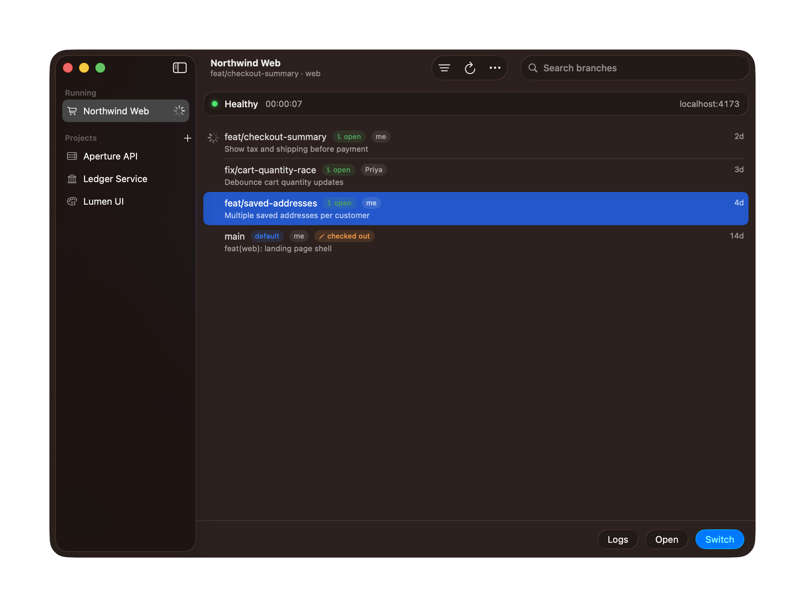
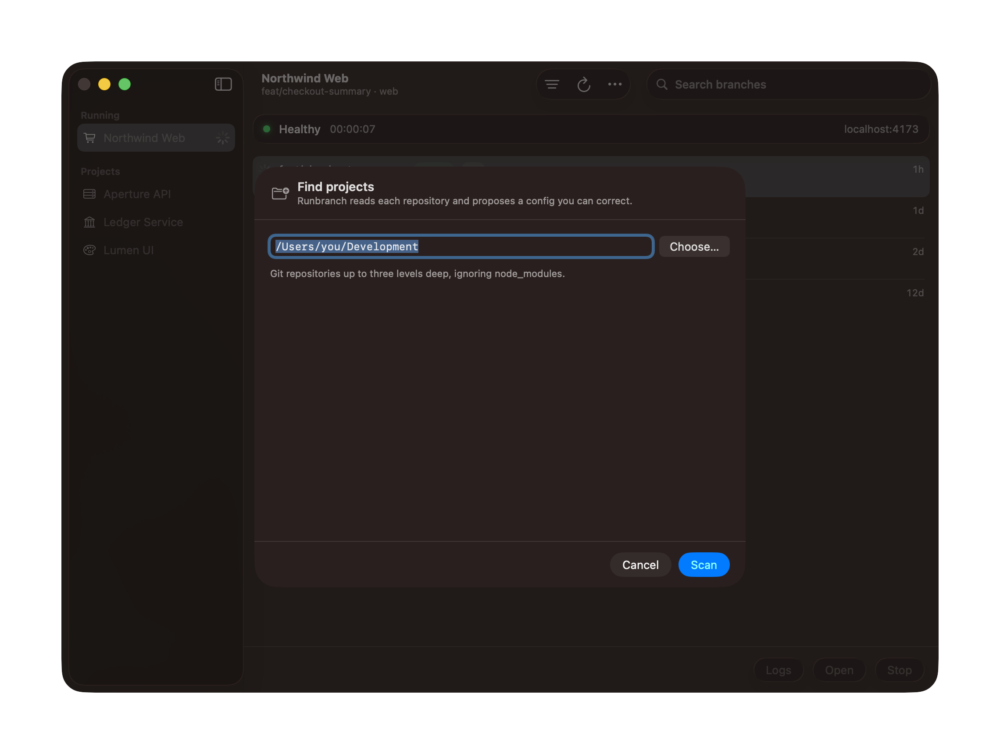
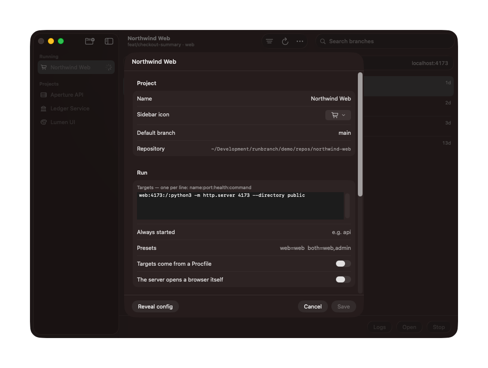

<div align="center">


# Runbranch

**Run any branch of any project, on a real port.**

Isolated by default — a throwaway git worktree, so your checkout is never
touched. Or in place, in the checkout itself, when what you want to see is what
you are typing.

[](LICENSE)
[](#install)
[](docs/TESTING.md)



</div>

---

## Why

A colleague's pull request needs a look. Not a diff — a look. You want to click
the thing. Your options today are all bad:

- **Switch branches in your checkout.** Fails on uncommitted work, or silently
  changes what you were doing.
- **Clone the repo again.** The gitignored `.env` doesn't come with it, so
  everything 401s and it looks like the branch is broken.
- **Keep a second checkout by hand.** You'll forget to update it, and you won't
  remember to delete its `node_modules`.
- **Wait for a preview deploy.** If the stack even has one, and if it can reach
  the data you need.

Runbranch does the version you'd build yourself given an afternoon: a throwaway
git worktree per branch, your gitignored config copied in, dependencies
installed, servers started, and a window that tells you when it's actually up.

> [!IMPORTANT]
> **Your checkout is never modified.** No `git checkout`, no `git stash`, ever.
> A worktree run happens in its own directory; an in-place run starts your
> servers where they already are and writes nothing.

---

## Install

You need the Xcode command line tools (`xcode-select --install`). Nothing else.

```bash
git clone https://github.com/aosmcleod/runbranch
cd runbranch && ./make-app.sh && open .
```

Drag `Runbranch.app` to the Dock.

> [!NOTE]
> The build is signed locally, not notarised, so the first launch needs
> **right-click → Open** rather than a double-click. Notarising it would need an
Apple Developer account; until then that prompt is the honest cost of building
it yourself.

By default `make-app.sh` signs ad-hoc, which means a new identity on every
build — and macOS ties privacy permissions to the signature, so anything you
grant the app is dropped the next time you rebuild. If that gets tiresome:

```bash
./tools/make-signing-identity.sh    # a self-signed identity, once
```

Builds then keep one stable identity, and a permission you grant survives a
rebuild. It does not make the app notarised and does not remove the
right-click on first launch.

---

## Point it at a repo



You shouldn't have to write a config from nothing. **Add project…** in the
`•••` menu reads the repo — package manager, lockfile, scripts, `Procfile`,
compose services, version pins, which files are gitignored — and proposes one,
then opens it so you can correct the guesses.

A complete project can be four lines:

```bash
NAME="my-app"
REPO="~/code/my-app"
INSTALL="pnpm install --frozen-lockfile"
TARGETS="web:3000:/:pnpm dev"
```

<details>
<summary><b>Bigger stacks add only what they need</b></summary>

```bash
COPY_FILES=".env.local"                    # gitignored, so a worktree lacks it
COMPOSE_SERVICES="postgres valkey"         # brought up and health-waited
MIGRATE="pnpm --filter @app/db db:migrate"
SEED="pnpm --filter @app/db db:seed"       # an empty app isn't worth looking at
RUNTIME="mise"                             # honour the repo's pinned versions
DB_URL_VARS="DATABASE_URL"                 # a database per branch
TARGETS="api:4000:/health:pnpm --filter api dev
web:3000:/:pnpm --filter web dev"
ALWAYS="api"                               # web is useless without it
PRESETS="web=web  full=web,worker"
```

A `Procfile` needs no target list at all — set `PROCFILE=1` and its processes
become your targets.

</details>

Full reference: **[docs/config.md](docs/config.md)**. Check any project with
`./runbranch.sh doctor`, which names the command that fixes whatever it finds.

---

## What you get

**A window that tells the truth.** Branches for the selected project, newest
first, each with its pull request state, who wrote it, and what it's actually
about — the PR title, not just the branch name. Remote branches with an open
pull request are listed too, because reviewing someone else's work is the whole
point. Merged and stale branches stay out of the way until you ask.

**A run you can watch.** Press Start and the work happens in front of you:
worktree, install, infrastructure, migrations, seed, servers. It closes itself
when the thing is up and stays put when it isn't — which is the only moment the
log matters.

**Two kinds of run, and the difference matters.**

|  | Worktree run *(default)* | In-place run |
|---|---|---|
| Where | Its own directory under `~/.runbranch` | Your checkout |
| Sees your edits | **No** — a snapshot of one commit | **Yes**, uncommitted work included |
| Any branch | Yes | Only the one your checkout is on |
| Installs, copies config, per-run database | Yes | **No** — servers only |
| Good for | A colleague's pull request, an old release, anything you are not editing | The branch you are working on right now |

A worktree run is a separate copy at one commit, which is what keeps it away
from your checkout — and it cuts both ways. Edits you make do not reach it, and
neither do new commits; the server is watching a different directory, so its
hot reload has nothing to react to. Start it again to pick up whatever is
newest.

> [!TIP]
> *Refresh* re-reads pull request metadata, not code. To pick up new commits,
> start the branch again.

The app says which is which. A branch your checkout is on is badged **checked
out**; one sitting in a worktree you made yourself is badged accordingly, since
it cannot be checked out twice; and a live in-place run is badged **in place**
next to its uptime.

**Data that doesn't leak between branches.** Two branches with divergent
migrations need not share a database. A project can declare one per run, seeded
from the same source and thrown away with the worktree.

**It knows what else is running.** A dev server you started in a terminal, or
an editor did, or an agent did, is not invisible to Runbranch: it can tell whose
it is, because it knows which directory belongs to which project. A project
whose ports are taken shows a warning in the sidebar before you press Start,
**Ports…** lists every declared port and what is on it, and a conflict names the
holder rather than shrugging at "another app". If it is plainly the same
project's own server, the conflict offers to take the port — naming the process
it will end, never as the default action.

**Worktrees are cheap to make and not free to keep.** Each one is a full
checkout — several hundred megabytes for a typical Node project — and nothing
removes them on its own. That is deliberate: a worktree with an installed
`node_modules` is what makes the second run of a branch fast, so throwing it
away the moment a run stops would be the wrong trade. But it does mean they
accumulate.

```bash
./runbranch.sh disk               # every worktree, its size, and whether it is in use
./runbranch.sh cleanup <project>  # pick which to remove
```

`disk` marks a worktree **gone** when the branch it was made from no longer
exists, which is the clearest sign nothing will want it again. It does not
claim to know what has been merged: a squash-merge leaves a branch looking
unmerged to git, so calling those reclaimable would eventually delete something
you still wanted.

**Status that keeps being true.** Uptime ticks. Health is polled, not assumed.
Processes and ports orphaned by a crash, a sleep or a force quit are found and
reclaimed on next launch — you should never go hunting with `lsof`.

**Every setting, in the app.** A project's whole config is editable in a sheet —
targets, presets, the copied files, the migration command, the sidebar glyph —
and it writes the same `.conf` you would have edited by hand. Removing a project
is in the right-click menu too, with a confirmation that names the repository it
will *not* delete.



**A sidebar that scales past four projects.** Running first, then favourites you
have pinned, then the rest. Search filters branches; the filter menu narrows to
your own, to open pull requests, or hides what is merged.

**Out of the way when you want it.** Runbranch can live in the Dock, in the menu
bar, or only in the menu bar — a status item showing what is running, with Stop
and a way back to the window. A demo runs for an hour while you use other apps,
and the window is not where you want the status.

---

## From a shell

The app is a window over `runbranch.sh`. Anything it does, you can do here.

```bash
./runbranch.sh                          # interactive
./runbranch.sh run studio main both
./runbranch.sh run studio main both --in-place    # the checkout, not a worktree
./runbranch.sh run studio main both 1             # shift every port by 1
./runbranch.sh stop studio
./runbranch.sh status                   # every project
./runbranch.sh doctor                   # check every config resolves
./runbranch.sh scan                     # repos not yet declared
./runbranch.sh add <repo>               # propose a config and write it
./runbranch.sh remove studio            # delete its config and state, never its repo
./runbranch.sh ports                    # every declared port, and what is on it
./runbranch.sh disk                     # worktree sizes, and what is reclaimable
./runbranch.sh cleanup studio           # remove worktrees
```

---

## Principles

- **Never touch the working checkout.** If a feature needs to, the design is wrong.
- **No daemon.** Nothing runs in the background when you're not using it. A run
  you started outlives the window on purpose — close the app, keep the demo —
  and anything orphaned is reclaimed rather than left for you to find.
- **The engine is a shell script you can read.**
- **Fail loudly, with the fix.** Every error names the command that resolves it.
- **Configuration is a file, not a database.** In the repo, versioned, diffable.

---

## It is not

- a process manager — [Overmind](https://github.com/DarthSim/overmind) is better
  at supervising a `Procfile` you already have;
- a worktree browser — [Grovr](https://github.com/j1king/grovr) and
  [Tower](https://www.git-tower.com/) are better at managing worktrees as worktrees;
- an agent orchestrator — [Conductor](https://conductor.build/) and
  [cmux](https://cmux.com/) run parallel coding agents;
- a preview deploy — Vercel and Netlify are better at showing a branch to the
  internet. Runbranch is for private repos, real local data, stacks that need a
  real database, and not waiting on a build queue;
- a sharing tool — what's running is on your machine, for you.

Runbranch does the narrow thing none of them do: **put any branch on a port,
and tell you when it's up.**

---

## Known limits

- **One run per project at a time.** Ports and databases are shared within a
  project, so starting a second stops the first. Different projects use
  different ports and can run at once. `PORTS="stepping"` is declared in the
  config format but not implemented.
- **Per-run databases are Postgres only.**
- **Fork branches aren't listed.** Remote branches on `origin` are; a pull
  request from someone's fork isn't yet.
- **macOS only**, and built against macOS 26 APIs.

---

## Layout

<details>
<summary><b>What is in the repository</b></summary>

```
runbranch.sh          the engine: git, install, infra, servers. No UI of its own.
app/RunBranch.swift   the front end
projects/*.conf       one file per project (yours are gitignored)
tests/engine.sh       engine tests; every case is a bug that really happened
make-app.sh           builds Runbranch.app
make-icons.sh         the graphic set, rendered from assets/mark.svg
assets/               the mark: colour PNG, and vectors for the mono templates
tools/                svg render, icon processing, signing identity, demo, screenshots
assets/mark.svg       the mark. Every raster asset is rendered from it
docs/config.md        every config key
docs/TESTING.md       what is covered, what is not, and how to add a case
docs/ROADMAP.md       what ships when, and why each item is worth doing
docs/VERSIONING.md    what the version numbers mean
```

Nothing generated is committed. `Runbranch.app`, `build/` and `demo/` are all
produced by the scripts and gitignored — the repo carries source, the mark as
a vector, and the screenshots the README displays.

</details>


## Licence

[GPL-3.0](LICENSE). Use it, change it, redistribute it — including
commercially. What you cannot do is take it closed: anything built on it has to
ship its source under the same terms.
